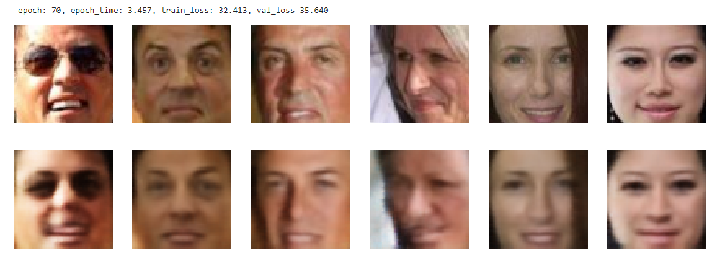

# This repository implements AE, VAE and CVAE.

1. We implement vanilla autoencoder and train it to encode and decode people's faces. We use Labeled Faces in the Wild dataset [1](https://vis-www.cs.umass.edu/lfw/), [2](https://www.cs.columbia.edu/CAVE/databases/pubfig/). Latent space dimension is 200. This dataset also has some features that describe some face properties like smiling index:
   

Autoencoders can be used for a variety of tasks: image denoising, image retrieval, anomality detection, dimensionality reduction, deep faes, etc. Vanilla AE looks like this.

After 70 epochs we get the following results:

2. In order to generate images using the trained Decoder we have to find the distribution of "faces" in the latent space. After generating latent vectors, we apply PCA and find that the latent vectors located on 55 dimensional manifold in 200 dimensional latent space. Using these 55 principal components we perfom kernel density estimation *scipy.stats.gaussian_kde()*.
Sampling from 55 dimensional space and apllying inverse PCA to project back to 200 dimensional latent space, we generate some faces:

To add a smile to a face, we identify the "smile vector" in latent space; aftewards, we add this vector to the face's latent representation.

3. Variational AE is based on [Variational Bayesian methods](https://en.wikipedia.org/wiki/Variational_Bayesian_methods).

It facilitates generation of new images usually from standard normal distribution in latent space. **The Reparameterization Trick** is used to propagate gradients through the probabilistic part of the network. Basically, it learns the mean and std of normal distribution in latent space. VAE was trained on MNIST dataset with 2 dimensional latent space.  
Some of generated images:

To explore the 2 dimensional latent space we encode a lot of samples from MNIST and plot them. In validation mode we implemented CVAE the way that it is **deterministic** and returns mean of normal distribution.

4. Finally we implement CVAE with 10 dimensional latent space, so we can generate desired digit from MNIST by passing one-hot encoded class representation into CVAE architecture:

Image below shows that we are able to generate all the digits from 0 to 9 from the same random latent vector (each row generated from the same latent vector, but with different condition)

Let's explore 10-dimensional latent space using t-SNE:
As we can see all latent vectors of the digits are mixed up in contrast with VAE, this is exactly the reason why we can generate any digit from the same latent vector.

