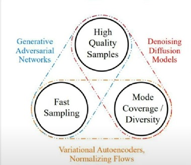
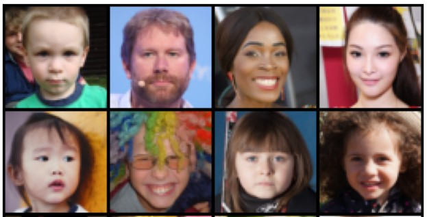
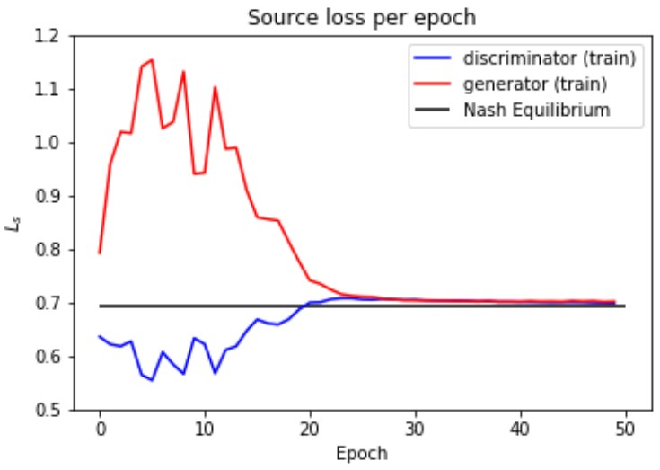
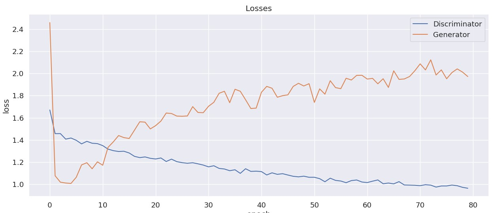
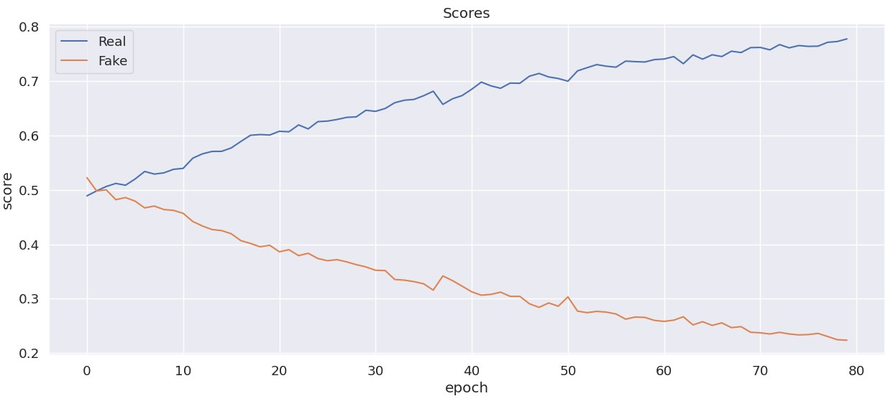
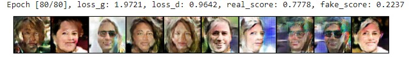
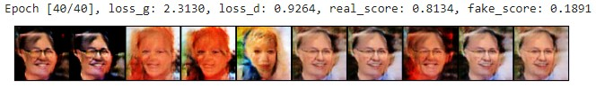
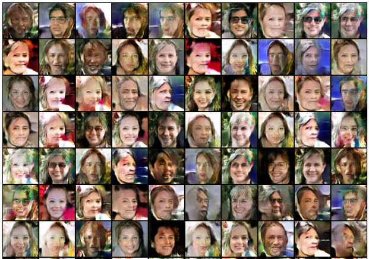
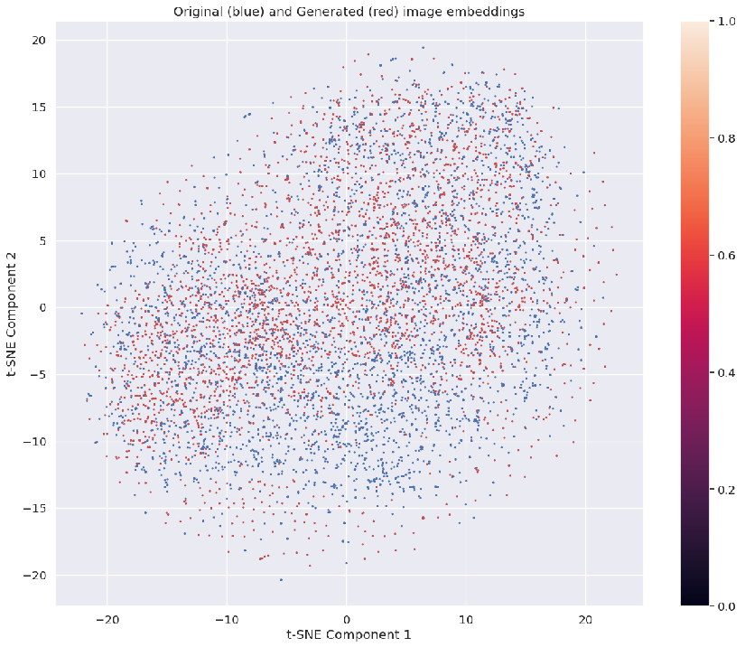
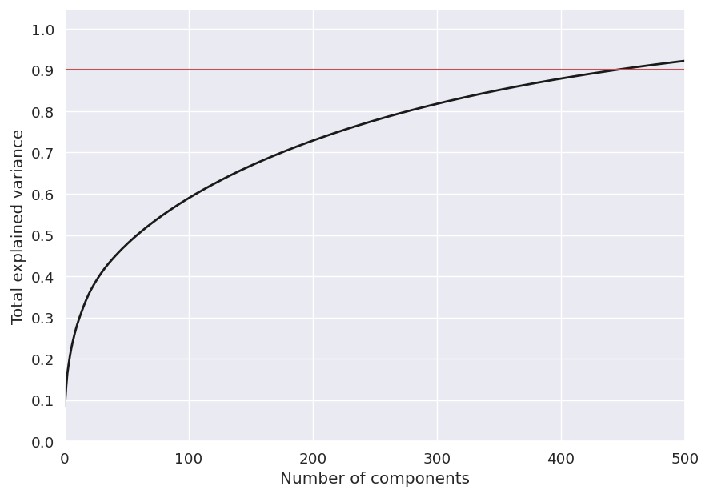

# Intro
In this repository a simple GAN generative model is implemented and trained for learning purposes. Due to high computational cost of GAN training and unavailability of the resources, the generated images have poor quality. GAN is one of several widely used generative models, there are also other modifications of vanilla GAN as StyleGAN and CircleGAN.

The core idea which GAN based on is to learn train set images' distribution through classification downstream task. Generative part of the GAN works similar to the [inverse transform sampling](https://en.wikipedia.org/wiki/Inverse_transform_sampling) from probability theory. The training goal of GAN can be interpreted as reaching the [Nash equilibrium](https://en.wikipedia.org/wiki/Nash_equilibrium#:~:text=A%20Nash%20equilibrium%20is%20a,Nash%20equilibrium) from game theory.

# Dataset
We use a [smaller version](https://www.kaggle.com/datasets/tommykamaz/faces-dataset-small?resource=download-directory) of FFHQ dataset consisting of 3143 photos of people's faces at 1024x1024 resolution. In order to make training task less computationally expensive, we resize images to 64x64.

# Architecture
We use quite straighforward architecture with transposed convolutions for generator and 2D convolutions for discriminator. The generator has 3'800'000 parameters and dicsriminator has 2'800'000.
The latent dimension (random vectors from wich images generated) was chosen to be equal 64.
# Training

Cross-Enthropy loss is used for building GAN loss. As discriminator's job is easier compared to  generator's, we smooth labels for true (y = 1) and fake (y = 0) images. 
NB: Other techniques to improve learning are swapping some real and fake images, adding noise to images and making more gradient descent steps for generator. 
The expected ideal loss behaviour where Nash equilibrium is reached, and minmax optimization reaches global optimum around 0.7. And discriminator predicts fake/real image with probability of 0.5 (it means that generator is good enough to fool discriminator). 

During actual training process, due to shortage of computational resources and inability to run many experiments, we got the following loss, which shows that discriminator learns too quickly.

The outperfomance of discriminator also can be seen from the average label prediction (scores) over epoch for real (y = 1) and fake (y = 0) images. An ideal situation would be that both curves stay around 0.5 as it was at the beginning of training when discriminator was still untrained.

After 80 epochs we made a decision to stop training:

As training further would lead to model collapse, i.e. the generator will generate the same image almost all the time:

# Generated images
As we said earlier, the discriminator outperformed generator too early, so our training process wasn't correct, but still our model at least generates some images resembling  faces with satisfactory variety.

# Generated images quality assessment
Besides using our own eyes, there are several ways to judge the similarity of generated images to real ones, e.g. [inception score](https://en.wikipedia.org/wiki/Inception_score).   
We used a simpler approach:
1. Get real/fake image embeddings using ResNet-50
2. Apply KNN-classifier with 1 neighbor + Leave-One-Out cross-validation.

If distribution blobs of real/fake images' embeddings are separate then average accuracy after cross-validation should be around 1. In ideal situation, when blobs are coincide and KNN cannot tell the difference between real/fake images the average accuracy is 0.5. The t-SNE represenation of our blobs looks like this:

And the average accuracy after applying KNN with leave-one-out cross-validation is 0.667.

# PCA analysis of ResNet-50 real images' embeddings 
The dimensionality of ResNet's embedding space is 1000.
After performing PCA analysis we find that embeddings of real images concentrated on some 500-dimensional manifold according to explained variance. 

