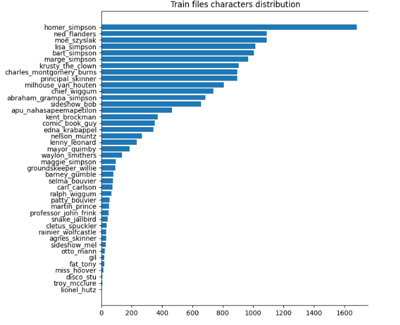
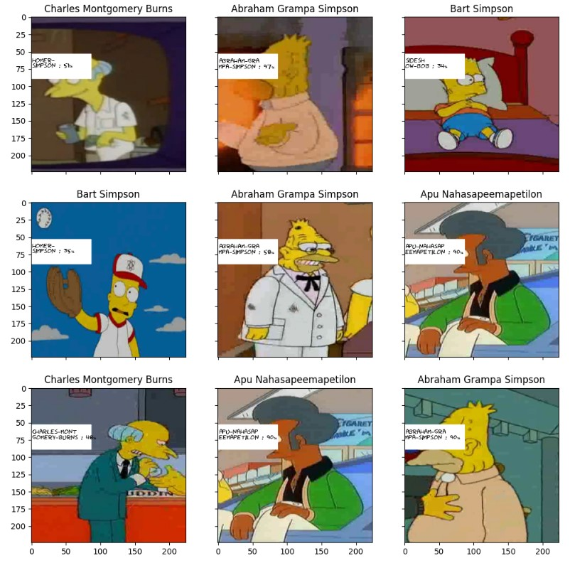

 Journey to Springfield [dataset](https://www.kaggle.com/competitions/journey-springfield/data) is used for this work. The 42 classes are highly unbalanced:

# Description

1. In order to deal with imbalanced data partial image augmentation is performed.
2. To deal with remained imbalance after the augmentation torch.utils.data.WeightedRandomSampler is used. This algorithm insures that each batch has some examples of underrepresented classes by assigning weight fort each class which, roughly sppeaking, correspond to probabilities of drawing particular class.
3. We use simple CNN with around 180,000 parameters
4. F1-macro metric is used to evaluate performance

Visualization of Image Classification performed by the model:
