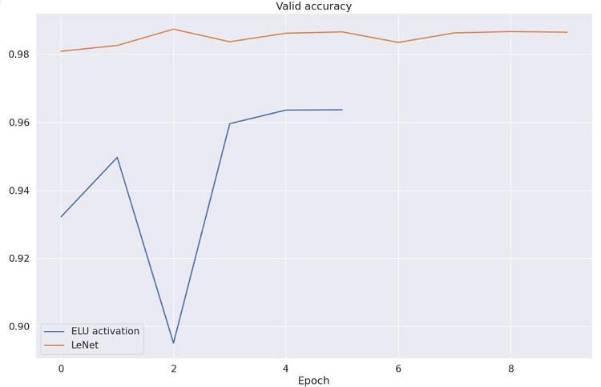

We use MNIST Dataset for this work.

# Description

1. Inverse PCA is performed on the dataset generated by sklearn.datasets.make_moons just for learning purposes. The loss of information can be observed.
2. The focus of this work is performance comparison of MLP (multilayer perceptron) with [LeNet](https://en.wikipedia.org/wiki/LeNet) on MNIST dataset. We can see that LeNet perform better than MLP with ELU activation:

