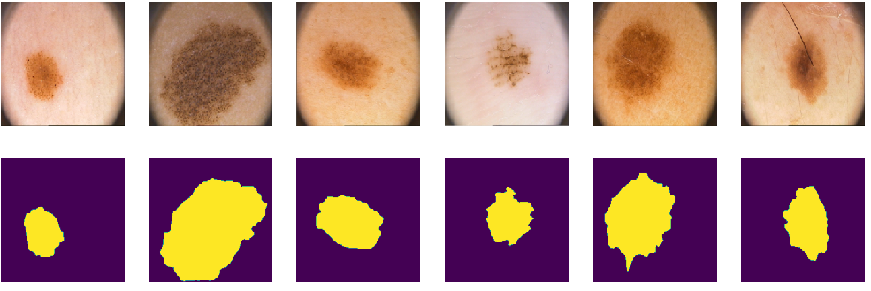
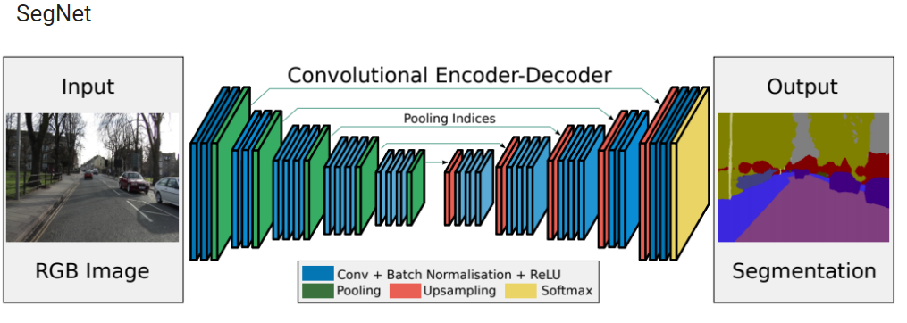
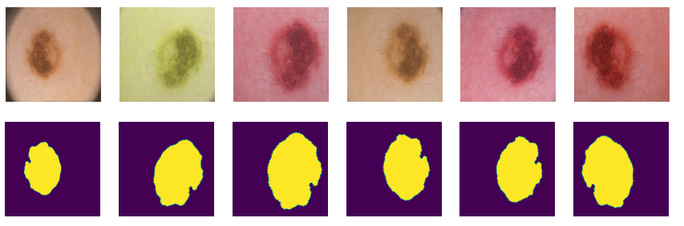
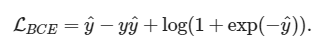
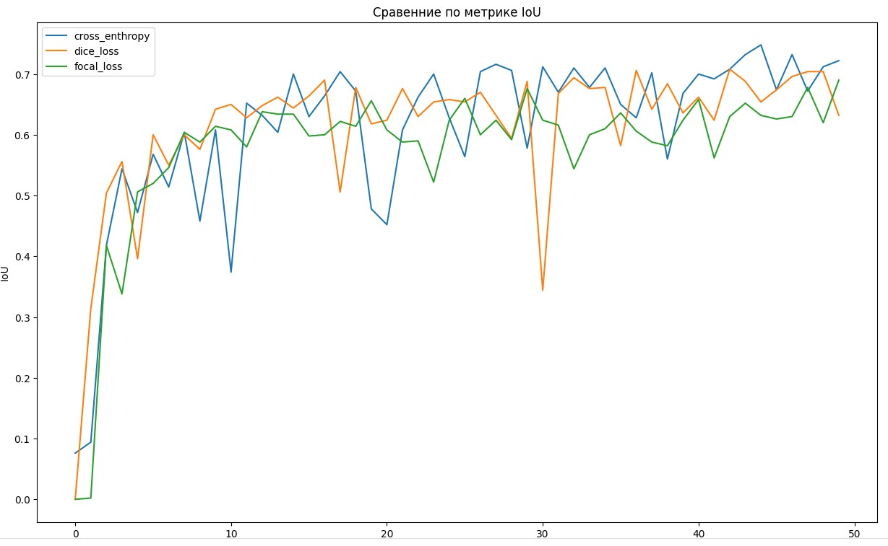
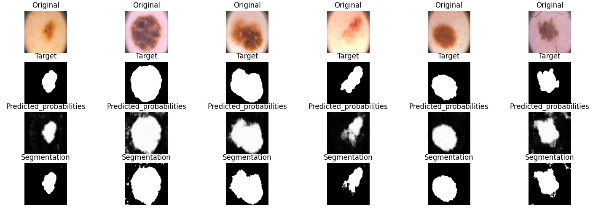

 [PH²](https://www.fc.up.pt/addi/project.html) is a dermoscopic image database acquired at the Dermatology Service of Hospital Pedro Hispano, Matosinhos, Portugal.Dermatology Service. There is a [copy](https://www.kaggle.com/datasets/kanametov/ph2dataset) of this dataset on Kaggle.
 

# Description

1. We use [SegNet](https://arxiv.org/pdf/1511.00561) network for segmentation. 

2. Some data augmentation was employed, including rotation, scaling and color jitter. Below is an example of data augmentation for the one particular skeen problem.

3. IoU (intersection over union) metric is chosen for evaluation
4. Comparison of 3 different losses has been conducted: cross-enthropy, [dice](https://paperswithcode.com/paper/generalised-dice-overlap-as-a-deep-learning) and [focal](https://arxiv.org/abs/1708.02002v2) loss.
The network with each loss was trained for 50 epochs.
NB: For cross-enthropy equivalent, but more numerically stable form is used 

The result of segmentation:

